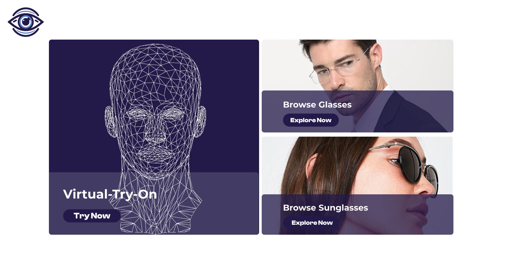
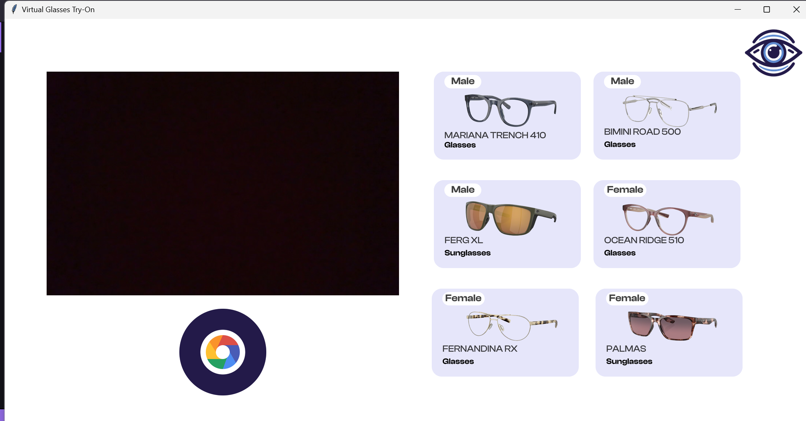
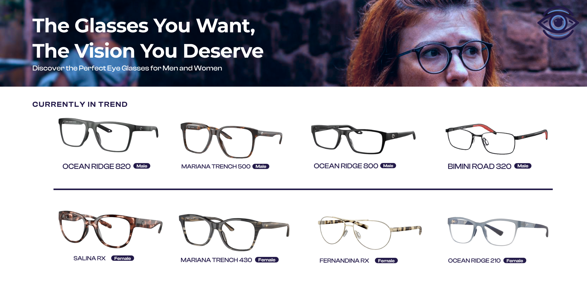
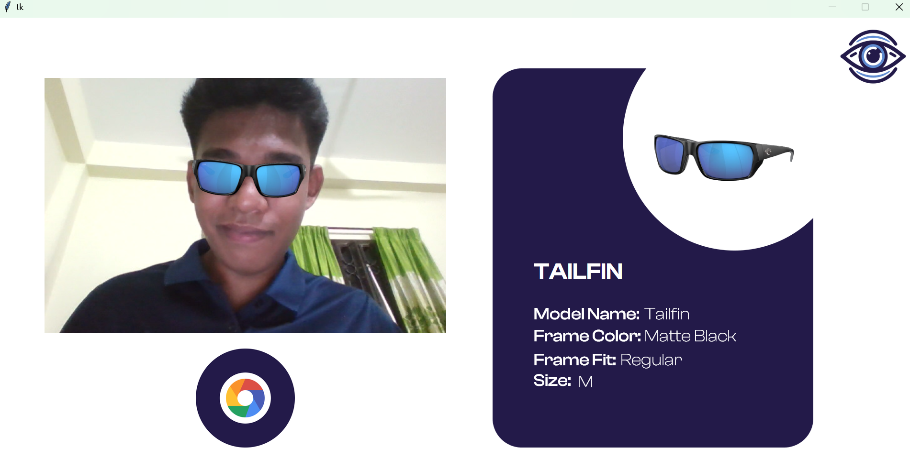

# **Lensify: 🕶️ Virtual Glasses Try-On Software**

Welcome to Lensify, a virtual glasses try-on software project developed as part of my 2nd Year final Software Project Course. This project allows users to virtually try on different glasses and modify their appearance using a user-friendly graphical user interface (GUI).

## **Test Runs**
To understand how this software works, it's essential to review the following components:

### **Facial Landmarks Detection**

**Facial Landmarks.py:**
This script detects and marks 68 facial landmarks on a user's face. These landmarks are crucial as they serve as coordinates for placing virtual glasses accurately on the user's face.

### **Glasses Overlay Integration**

**Glasses Overlay Test Run/code.py:**

Here, glasses are overlaid onto the user's face based on the detected facial landmarks. This integration demonstrates how virtual glasses are positioned and adjusted in real time.

### **Glasses Database Integration**
**test.py:**

This program integrates the glasses database (glasses.db) with the main application. Users can cycle through different glasses using keyboard shortcuts ('n' for next, 'p' for previous) without needing to specify the path manually. Each pair of glasses in the database is associated with an ID that facilitates seamless switching.

## **Main GUI Program**
The build_main directory contains all the necessary assets and the main GUI program:

### **Running the Main GUI**
**To run the main GUI program:**

Navigate to the build_main directory.
Execute python main.py to launch the interface.
Interface Overview
**Home Page:** The landing page where users start exploring different glasses options.
**Virtual Try-On:** Users can click on glasses images to see how they look on their face.

Screenshots
Here are some screenshots illustrating the Lensify interface:

## **Home Page:**

## **Selection Page:**

## **Virtual-Try-On**

## **Glasses Catalogue**

## **Contact Information**
For questions, feedback, or collaboration opportunities, feel free to reach out:

**LinkedIn:** https://www.linkedin.com/in/vintech/

